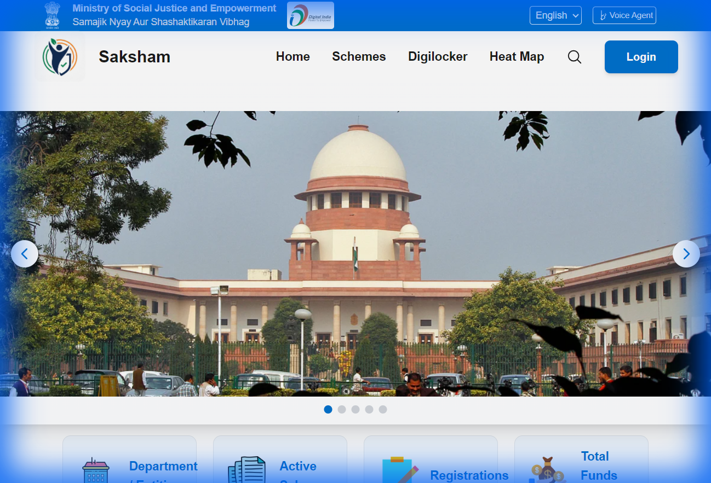

# SAKSHAM - Unified Beneficiary & Officer Portal

> **Empowering Governance through Digital Transformation.**
> A Single Window Interface for Officer Administration, Scheme Management, and Citizen Services.



## 🇮🇳 Overview

**SAKSHAM** is a comprehensive web-based platform designed to bridge the gap between Government Schemes and Beneficiaries. It provides a robust **Officer Dashboard** for field operations and a seamless **Citizen Interface** for accessing entitlements.

Built with modern web technologies, SAKSHAM aims to enable transparency, efficiency, and accessibility in social welfare distribution under the *Ministry of Social Justice and Empowerment*.

## ✨ Key Features

### 🏛️ For Officers (Administration)
- **Interactive Dashboard**: Real-time KPI cards, district statistics, and quick action modules.
- **Document Verification**: Streamlined interface to review, approve, or reject citizen applications with AI-assisted insights.
- **Field Enumeration**: Tools for scheduling visits, offline data collection, and management.
- **Beneficiary Profiling**: Deep analytics and demographic insights using interactive charts.
- **PFMS Integration**: Management of Direct Benefit Transfer (DBT) batches and disbursements.
- **Role-Based Access**: Secure login and distinct workflows for Admins and Field Officers.

### 👥 For Citizens & Beneficiaries
- **Unified Login**: Easy access to track applications and status.
- **Voice Assistant**: Integrated "Blind Mode" with voice commands for accessibility.
- **Scheme Registry**: searchable catalog of available government schemes.
- **Mobile Responsive**: Fully optimized for field use on tablets and mobile devices.

## 📸 Screenshots

### Officer Dashboard
Real-time insights and quick access to verification tools.


## 🛠️ Tech Stack

- **Frontend Framework**: [React](https://react.dev/) (v19)
- **Build Tool**: [Vite](https://vitejs.dev/)
- **Styling**: [Tailwind CSS](https://tailwindcss.com/) with Glassmorphism effects
- **Routing**: React Router v7
- **Authentication & Backend**: Firebase (Auth, Firestore)
- **Visualization**: Recharts, Leaflet (Maps)
- **Internationalization**: i18next (English/Hindi)
- **Icons & UI**: Heroicons, Framer Motion

## 🚀 Getting Started

Follow these instructions to set up the project locally.

### Prerequisites
- Node.js (v18 or higher)
- npm or yarn
- Firebase account (for backend configuration)

### Installation

1. **Clone the repository**
   ```bash
   git clone https://github.com/Pranav77722/SIH_final_project_2025.git
   cd SIH_final_project_2025
   ```

2. **Install Dependencies**
   ```bash
   npm install
   ```

3. **Configure Environment**
   Create a `.env` file in the root directory if needed, or update `src/firebase/client.js` with your Firebase credentials.

4. **Run Development Server**
   ```bash
   npm run dev
   ```
   The app will typically be available at `http://localhost:5173`.

## 📁 Project Structure

```
src/
├── api/             # API service layer (Mock & Real)
├── components/      # Reusable UI components
│   ├── common/      # Buttons, Cards, Inputs
│   └── layout/      # Layout wrappers (Sidebar, Header)
├── pages/           # Page views
│   ├── admin/       # Admin specific pages
│   ├── officer/     # Officer dashboard & sub-pages
│   └── Landing.jsx  # Main landing page
├── protected/       # Route protection logic
├── hooks/           # Custom React hooks (useAuth, etc.)
└── theme/           # Design tokens and theme config
```

## 🤝 Contribution

Contributions are welcome! Please fork the repository and submit a pull request for any enhancements.

1. Fork the Project
2. Create your Feature Branch (`git checkout -b feature/AmazingFeature`)
3. Commit your Changes (`git commit -m 'Add some AmazingFeature'`)
4. Push to the Branch (`git push origin feature/AmazingFeature`)
5. Open a Pull Request

## 📄 License

This project is licensed under the MIT License - see the [LICENSE](LICENSE) file for details.

---
*Designed & Developed for Smart India Hackathon 2025*
